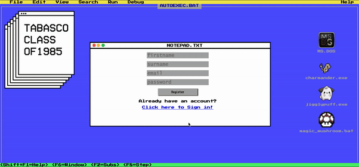

# about

Class of 85 is social network app for students who wants to keep in touch within their classmates after graduation. I built it with BIOS theme style for the nostalgic look.

# features

## home, register or login

Users are welcomed with a landing page and invited to register or login. They can also add bio and change their profile pics



# technologies

-   React
-   AWS
-   Node.js
-   Express.js
-   PostgreSQL

# instructions

you need an AWS account to run the Survivor.

1.  clone repository

```bash
git clone https://github.com/gugiguger/class0f85
cd classof85
```

2.  install dependencies

```bash
npm install
```

3.  setup database

you need PostgreSQL at least version 9 and your system user needs to be able to access the server without a password.

```bash
createdb survivor
cd sql
psql -d classof85 -f users.sql
psql -d classof85 -f friendships.sql
psql -d classof85 -f chat.sql
```

4.  create S3 bucket and credentials

go to the AWS console and create a S3 bucket in the eu-west-1 region. in the bucket create a folder named as you want.

the bucket and folder name need to be exchanged in the s3.js file with the one you created.

in AWS IAM create security credentials for a user that can write to the new bucket and put the access key and secret into a file called secrets.json.

```json
{
    "AWS_KEY": "YOUR AWS KEY",
    "AWS_SECRET": "YOUR AWS SECRET"
}
```

5.  start the application and the bundle server

```bash
npm start
```

in a new terminal

```bash
node bundle-server.js
```

now go to http://localhost:8080 in your browser
